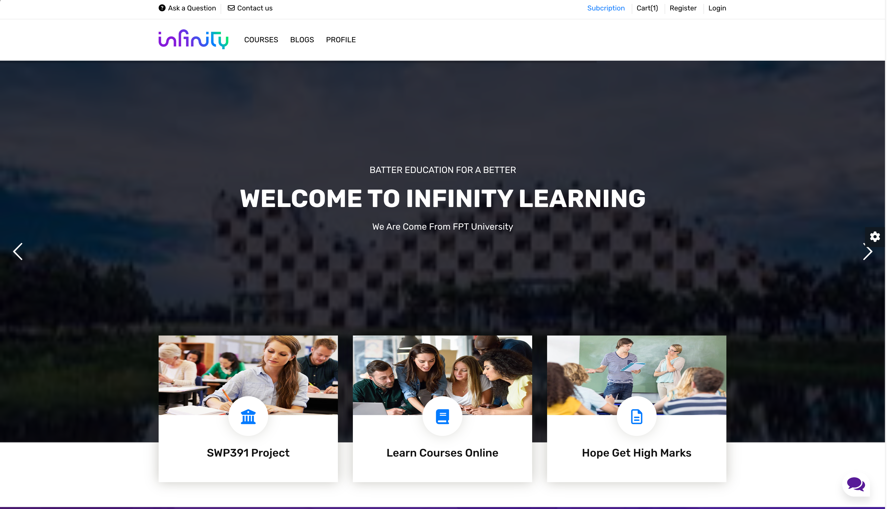
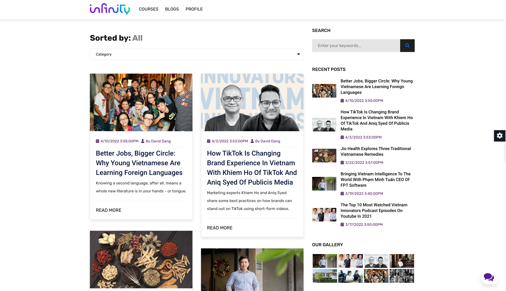
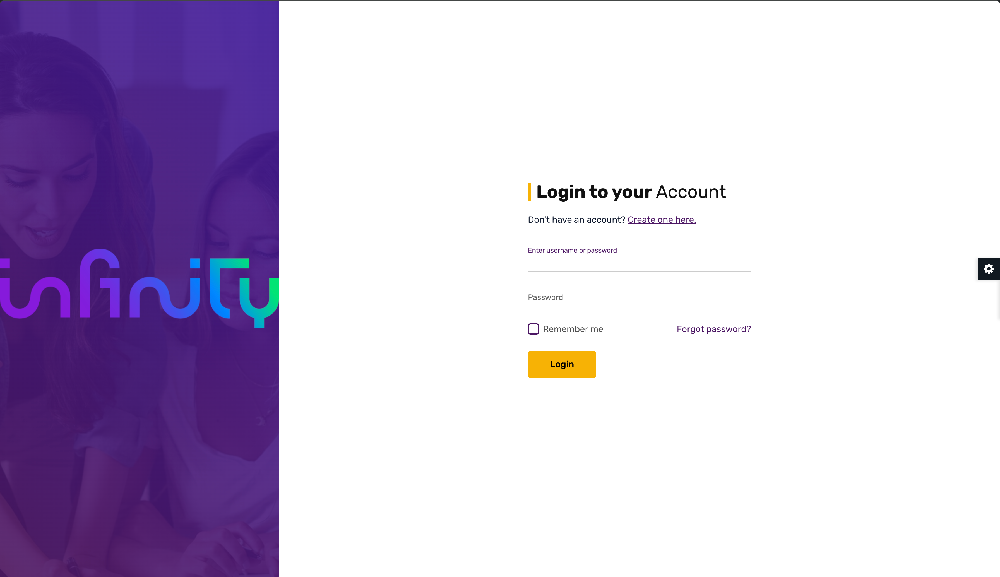
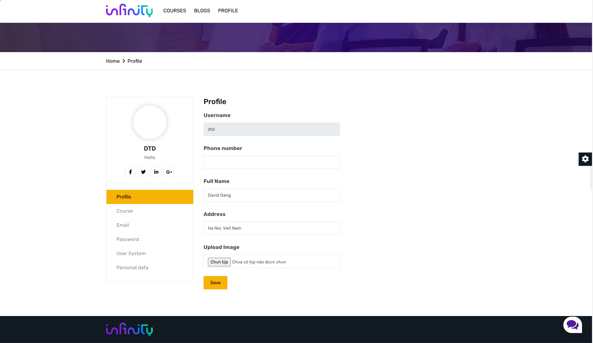
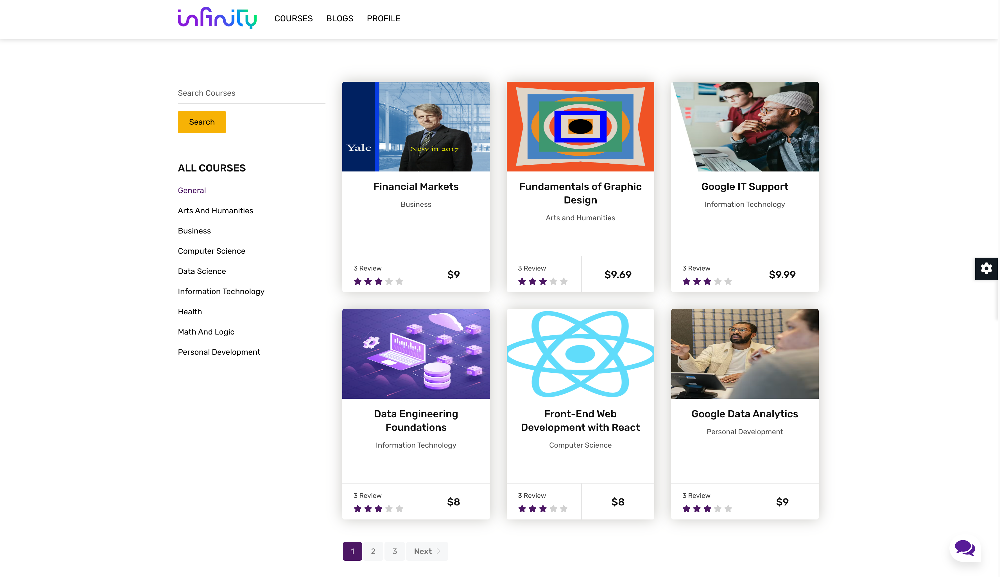
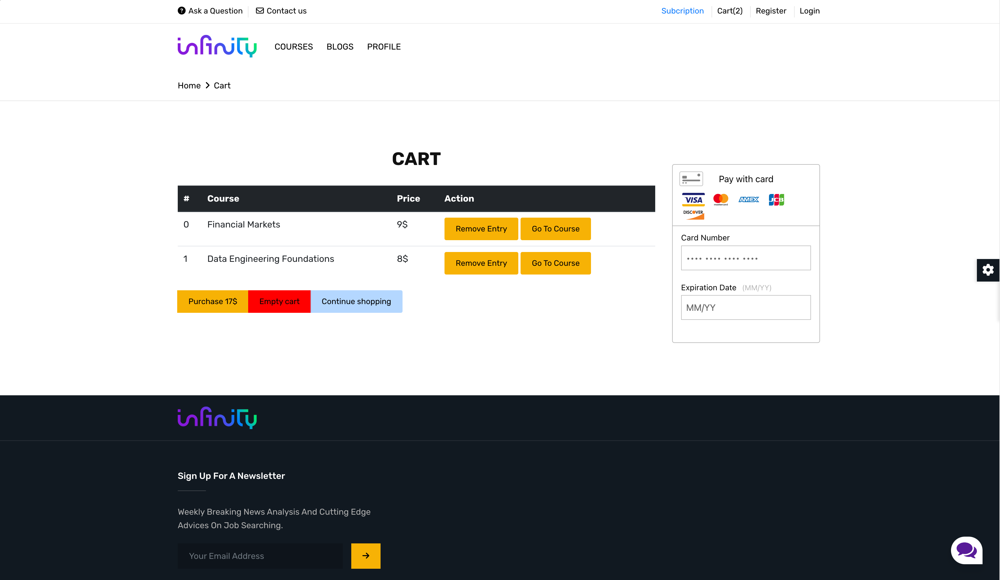

# Infinity Learning

A platform for online education where users can purchase courses, watch instructional content, and participate in quizzes.

## Main Features
- Main core - ASP.NET Core Razor Pages (.NET 5)
- Authentication and authorization using [ASP.NET Identity](https://learn.microsoft.com/vi-vn/aspnet/identity/)
- Encrypt user password
- Send email confirm/reset password with [MailKit (3.1.1)](https://www.nuget.org/packages/MailKit/)
- Shopping cart
- Purchase courses and take quizzs

## Demo

#

#

#

#

#

#
